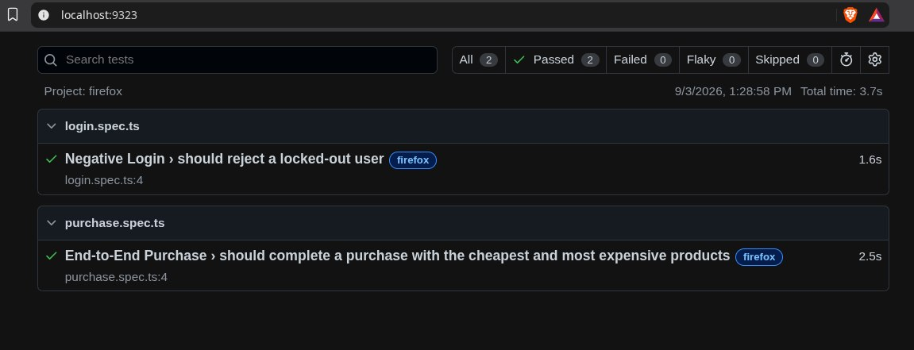

<div align="center">

# 🎭 SauceDemo Playwright Automation

### End-to-End E-Commerce UI Automation with Playwright + TypeScript + POM

<p>


</p>

**✅ 2 Tests Passed &nbsp; | &nbsp; ❌ 0 Failed &nbsp; | &nbsp; 🦊 Firefox Verified**

</div>

---

## 🚀 What Is This?

A clean, maintainable **SQA web automation framework** built with **Playwright + TypeScript + `@playwright/test`**, using [SauceDemo](https://www.saucedemo.com/) as the application under test.

The project follows **Page Object Model (POM)** to keep UI interaction logic separate from business-level test scenarios.

---

## 🎯 Automated Scenarios

### 🔐 Negative Login

Validates that a locked-out user cannot log in.

```text
Username: locked_out_user
Password: secret_sauce
```

Expected:

```text
Epic sadface: Sorry, this user has been locked out.
```

### 🛒 End-to-End Purchase

```text
Login
  ↓
Sort by Price (low → high)
  ↓
Find cheapest + most expensive products
  ↓
Add both products to cart
  ↓
Verify cart contents
  ↓
Checkout
  ↓
Enter customer details
  ↓
Finish order
  ↓
Verify "Thank you for your order!"
```

---

## 🏗️ Framework Architecture

```text
                    TEST SPECS
          ┌──────────────────────────┐
          │ login.spec.ts            │
          │ purchase.spec.ts         │
          └────────────┬─────────────┘
                       │
                       ▼
                PLAYWRIGHT FIXTURE
                 src/fixtures/test.ts
                       │
                       ▼
                  PAGE OBJECTS
       ┌─────────────────────────────────┐
       │ LoginPage                        │
       │ InventoryPage                    │
       │ CartPage                         │
       │ CheckoutPage                     │
       └───────────────┬─────────────────┘
                       │
                       ▼
                 PLAYWRIGHT
                       │
                       ▼
                  SAUCEDEMO
```

### Separation of Responsibilities

| Layer | Responsibility |
|---|---|
| **Test Specs** | Business flow + assertions |
| **Page Objects** | Locators + UI actions |
| **Fixtures** | Reusable page-object setup |
| **Config** | Browser, timeout, reporter, base URL |
| **Playwright** | Browser automation + synchronization |

---

## 📂 Project Structure

```text
saucedemo-playwright-ts-pom/
│
├── src/
│   ├── fixtures/
│   │   └── test.ts
│   └── pages/
│       ├── LoginPage.ts
│       ├── InventoryPage.ts
│       ├── CartPage.ts
│       └── CheckoutPage.ts
│
├── tests/
│   ├── login.spec.ts
│   └── purchase.spec.ts
│
├── playwright.config.ts
├── package.json
├── package-lock.json
├── tsconfig.json
├── .gitignore
└── README.md
```

---

## 🧪 Test Design

### Resilient Locators

The framework prioritizes Playwright's recommended locator strategies:

```ts
page.getByTestId(...)
page.getByRole(...)
page.locator(...)
```

SauceDemo uses `data-test`, so the configuration maps:

```ts
testIdAttribute: 'data-test'
```

### Synchronization

The framework relies on Playwright **auto-waiting** and **web-first assertions**.

No hard-coded delays such as:

```ts
page.waitForTimeout(...)
```

The purchase test finishes with:

```ts
await expect(locator).toHaveText('Thank you for your order!');
```

---

## ⚙️ Configuration

Global settings are centralized in `playwright.config.ts`.

```text
Base URL        https://www.saucedemo.com/
Test timeout    30 seconds
Expect timeout  5 seconds
Headless        true
Browsers        Firefox + Chromium
Reporter        HTML + list
Trace           On first retry
Screenshot      On failure
Video           On failure
```

---

## ▶️ Quick Start

### Install

```bash
npm install
```

### Install browsers

```bash
npx playwright install
```

Linux dependencies, when required:

```bash
npx playwright install --with-deps
```

### Run everything

```bash
npx playwright test
```

### Run Firefox

```bash
npx playwright test --project=firefox
```

### Run Chromium

```bash
npx playwright test --project=chromium
```

### Run headed

```bash
npx playwright test --headed
```

### Run UI mode

```bash
npx playwright test --ui
```

### Type-check

```bash
npm run typecheck
```

### Open HTML report

```bash
npx playwright show-report
```

---

## 📊 Test Execution Evidence

### Firefox — Verified

| Metric | Result |
|---|---:|
| Tests | **2** |
| Passed | **2** |
| Failed | **0** |
| Flaky | **0** |
| Skipped | **0** |

**Passing scenarios**

```text
✓ Negative Login
✓ End-to-End Purchase
```

### Playwright Report



---

## ✅ Assessment Coverage

| Requirement | Status |
|---|:---:|
| Page Object Model | ✅ |
| Playwright Locator objects | ✅ |
| No inline locators in specs | ✅ |
| `@playwright/test` | ✅ |
| Centralized `playwright.config.ts` | ✅ |
| Locked-out login | ✅ |
| End-to-end purchase | ✅ |
| Low-to-high sorting | ✅ |
| Cheapest + most expensive products | ✅ |
| Cart verification | ✅ |
| Checkout completion | ✅ |
| `toHaveText()` success assertion | ✅ |
| Auto-waiting | ✅ |
| Resilient locators | ✅ |
| HTML Reporter | ✅ |

---

## 🛠️ Why This Framework Is Maintainable

**Readable tests**  
Business scenarios remain easy to understand.

**Reusable page objects**  
UI changes can be isolated inside the relevant Page Object.

**Centralized configuration**  
Browsers, timeouts, reporters, and base URL are managed in one place.

**Better synchronization**  
Playwright's built-in waiting and web-first assertions reduce timing-related failures.

**Debug-friendly**  
Failure screenshots, video, and trace-on-retry are configured.

---

## 🔮 Future Roadmap

```text
Data-Driven Testing
        ↓
Authentication State Reuse
        ↓
API + UI Hybrid Testing
        ↓
Parallel Execution
        ↓
GitHub Actions CI/CD
        ↓
Advanced Reporting
```

---

# 👨‍💻 About Me

## Md Mostafizur Rahman Zahid

**CSE Graduate · SQA · Aspiring Security Engineer · Cybersecurity & DevSecOps Learner**

I am a Computer Science & Engineering graduate building practical expertise in:

**Software Quality Assurance · Test Automation · Cybersecurity · Linux · DevSecOps · Cloud · Software Engineering**

My focus is on building reliable automation frameworks, improving software quality practices, and developing strong engineering fundamentals with a security-aware mindset.

### 🔗 Connect

- **GitHub:** https://github.com/mostafizur-zahid
- **LinkedIn:** https://www.linkedin.com/in/mostafizur-zahid/

---

<div align="center">

**Playwright • TypeScript • @playwright/test • Page Object Model**

⭐ Built as part of my SQA & Test Automation portfolio.

</div>
